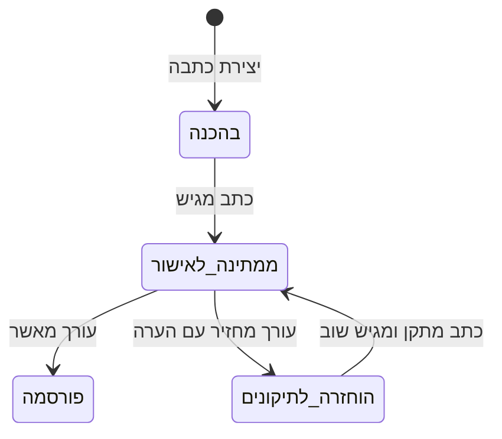

<div dir="rtl">

# The Daily Web - מפת הפרויקט המלאה

## 1. מה מטרת הפרויקט?

לבנות מערכת חדשות אינטרנטית מלאה בשם **The Daily Web**, בדומה לאתר חדשות מודרני. המערכת אינה רק עמוד שמציג כתבות: היא צריכה לנהל את כל מחזור החיים של כתבה - כתיבה, שמירה אוטומטית, שליחה לבדיקה, החזרה לתיקונים, אישור, פרסום, עדכון של כתבה שכבר פורסמה, תגובות, צפיות וניתוח השפעת העדכונים.

יש שלושה סוגי משתמשים:

1. **אורח (Guest)** - קורא כתבות שפורסמו, מחפש, מסנן, ממיין ומגיב.
2. **כתב (Reporter)** - יוצר ועורך את הכתבות שלו ומגיש אותן לאישור.
3. **עורך (Editor)** - מנהל את כלל הכתבות, עורך, מאשר, מפרסם, מחזיר לתיקונים ומוחק תוכן.

מבחינת הקורס, מטרת הפרויקט היא להוכיח שאתם יודעים לבנות אפליקציית Client-Server מלאה בארכיטקטורת MVC, עם מסד נתונים, REST, Ajax, אימות משתמשים, הרשאות, טיפול בשגיאות, ביצועים ועבודת צוות ב-Git.

---

## 2. כללי ברזל מנהליים

- העבודה היא בקבוצה של **4-5 סטודנטים**.
- כל חברי הקבוצה חייבים להיות רשומים **לאותו מרצה**. ערבוב בין מרצים גורר ציון 0.
- כל סטודנט חייב להכיר ולהסביר **את כל הקוד**, ולא רק את החלק שהוא כתב.
- חובה לעבוד עם Git לכל אורך הפיתוח.
- לכל סטודנט צריך להיות חשבון Git אישי, והוא צריך לעבוד מהמחשב שלו.
- נדרשים commits תכופים ומתועדים, branches, merges ו-pull requests.
- בהגנה צריך להראות את התרומה של כל חבר ואת תהליך העבודה המשותף.
- יש להגיש עד 23:59 ביום שלפני ההגנה, כלומר לפחות 24 שעות לפני ההגנה.
- איחור בהגשה גורר הפחתה של 20 נקודות מציון הפרויקט.
- כל סטודנט נבחן פעם אחת בלבד; אין מקצה תיקונים או שיפור לאחר ההגנה.
- ההגשה כוללת ZIP של כל הקוד במודל וקישור לצפייה במאגר Git.
- המאגר צריך להיות פתוח לצפייה, אך אסור לפרסם בו סיסמאות, API keys או tokens.
- בהגנה תיבדק אך ורק הגרסה שהוגשה. אי אפשר לתקן תוך כדי ההגנה.
- המרצה יפעיל את המערכת בעצמו ויבדוק אותה שוב גם לאחר ההגנה.

הציון נקבע לפי ההגנה, איכות הקוד, נראות, חוויית משתמש, יציבות, עבודת צוות ועמידה בדרישות הטכניות. לפי הסילבוס, הפרויקט וההגנה מהווים **85% מציון הקורס**.

---

## 3. טכנולוגיות - מה חובה, מה מותר ומה אסור

### טכנולוגיות חובה

| שכבה | טכנולוגיה/גישה | שימוש נדרש |
|---|---|---|
| צד שרת | Node.js | סביבת הריצה של השרת |
| צד שרת | Express | ניתוב, controllers, middleware ו-API |
| ארכיטקטורה | MVC | הפרדה ברורה בין Model, View ו-Controller |
| מסד נתונים | MongoDB | אחסון ושליפת כל המידע |
| ORM/ODM | Mongoose | הגדרת schemas/models וגישה ל-MongoDB |
| צד לקוח | Vanilla JavaScript | לוגיקה ואינטראקטיביות בדפדפן |
| תקשורת | Ajax | פעולות אסינכרוניות ללא רענון מלא |
| API | REST | תכנון ממשקי המידע והנתיבים |
| תבניות שרת | EJS | רינדור בצד השרת במקומות המתאימים |
| מבנה | HTML5 סמנטי | שימוש בתגיות כמו header, nav, main, article, aside ו-footer |
| עיצוב | CSS + Flexbox | עיצוב רספונסיבי למחשב, טאבלט ומובייל |

### מותר במפורש או נלמד בקורס

- **Chart.js או canvas** להצגת גרף Impact Analytics - שתי האפשרויות הותרו במפורש.
- **Bootstrap** מופיע בהרצאה מספר 3, ולכן לפי החומר שסופק הוא טכנולוגיה שנלמדה ונראה שמותר להשתמש בו.
- שירות מזג אוויר חיצוני חינמי ומוכר, למשל OpenWeatherMap או שירות מקביל, במסלול ללא פרטי אשראי.
- למידה עצמית לצורך פתרון הדרישות החדשות, כל עוד המימוש נשען על הטכנולוגיות המותרות.

### אסור

- React, Angular, Vue או framework חיצוני אחר שלא נלמד בכיתה.
- ספריות או frameworks חיצוניים שלא נלמדו בכיתה, גם אם הם מקצרים את העבודה.
- קוד מועתק מפרויקטים אחרים, מחברים, מאתרים או ממאגרים. קוד מועתק עלול לפסול את הפרויקט כולו.
- שמירת סיסמאות כטקסט גלוי או בצורה שניתנת לשחזור.
- הסתמכות על הסתרת כפתור בצד הלקוח בתור הרשאה. כל הרשאה חייבת להיבדק בשרת.
- שמירת סודות במאגר Git.
- שינוי הקוד לאחר ההגשה לצורך ההגנה.

### דורש אישור מהמרצה לפני שימוש

הכלל הבטוח הוא: אם חבילה אינה חלק מ-Node/Express/Mongoose, אינה נלמדה בכיתה ואינה מוזכרת במסמך - לא מוסיפים אותה בלי אישור כתוב. זה חשוב במיוחד לגבי ספריות authentication, sessions, העלאת תמונות, validation, logging ו-CSS נוספות.

---

## 4. שימוש ב-AI

מותר להיעזר ב-ChatGPT ובכלי AI אחרים. לפי הסילבוס, השימוש אף מעודד, אבל קיימות ארבע חובות:

1. לבדוק את אמינות התוצר.
2. להבין לעומק כל קטע קוד שנוסף.
3. לאזכר את השימוש ב-AI בעבודה.
4. למלא את טופס ההצהרה באתר הקורס.

בהגנה אפשר לשאול כל סטודנט על כל שורה. לכן אסור להכניס קוד שאף אחד בקבוצה לא מסוגל להסביר, גם אם הוא עובד.

---

## 5. דרישות פונקציונליות לפי מסך

### 5.1 מסך הבית - פיד חדשות ציבורי

העמוד פתוח לכולם ומציג **רק כתבות שאושרו ופורסמו**.

- גלילה אינסופית.
- בכל טעינה מתקבלות 20 כתבות נוספות.
- הטעינה מתבצעת כשהמשתמש מתקרב לתחתית הפיד.
- חיפוש כתבות, לפחות לפי שדה מרכזי כגון כותרת.
- סינון לפי קטגוריה.
- סינון לפי נצפה/לא נצפה.
- אפשר לשלב כמה מסננים יחד.
- מיון לפי תאריך פרסום או פופולריות.
- כל כרטיס מציג כותרת, תמונה, תקציר, קטגוריה, כתב ותאריך פרסום.
- מעבר לעמוד כתבה מלא.
- חיפוש, סינון, מיון וטעינת עוד כתבות פועלים ב-Ajax ללא רענון מלא.

### 5.2 עמוד כתבה ציבורי

- כותרת, שם הכתב, קטגוריה, תאריך פרסום ותמונה ראשית.
- תוכן מלא.
- רשימת תגובות.
- טופס להוספת תגובה.
- תגובה חדשה מתווספת מיד לרשימה בלי לטעון מחדש את כל הרשימה.
- כל כניסה לעמוד נספרת לצורך צפיות וסטטיסטיקות.
- התוכן המלא חייב להיות בתוך ה-HTML הראשוני שמוחזר מהשרת כדי שמנועי חיפוש יוכלו לקרוא אותו. אסור להסתמך על JavaScript כדי לטעון את גוף הכתבה.

### 5.3 הגבלת תגובות

- אורח רשאי לפרסם לכל היותר **3 תגובות בדקה מאותו מכשיר**.
- הניסיון הרביעי נחסם בשרת.
- השרת מחזיר הודעה מתאימה והלקוח מציג אותה.
- הבדיקה בצד הלקוח יכולה לשפר UX, אבל אינה מחליפה את הבדיקה בצד השרת.

### 5.4 מסך התחברות

- התחברות באמצעות שם משתמש וסיסמה לכתבים ולעורכים.
- כתב מועבר לאזור הכתב.
- עורך מקבל גישה לאזור הניהול.
- התפקיד נלקח מהמשתמש המאומת בשרת, לא מערך שנשלח מהדפדפן.
- אורח יכול לגשת רק למסכים הציבוריים.
- לאחר Restart של השרת, משתמש שכבר התחבר צריך להמשיך להיות מחובר.

### 5.5 אזור כתב

הכתב רואה את הכתבות השייכות לו ואת מצבן:

- בהכנה.
- ממתינה לאישור עורך.
- פורסמה.
- הוחזרה לתיקונים.

הכתב יכול ליצור כתבה, לערוך טיוטה שלו, לשלוח לאישור, לקרוא הערת עורך, לתקן ולהגיש מחדש. הוא יכול להתחיל עריכה גם לכתבה שכבר פורסמה, אבל הוא אינו יכול לפרסם בעצמו ואינו יכול לערוך כתבה השייכת לכתב אחר.

### 5.6 שמירה אוטומטית והמשכיות עבודה

- העבודה נשמרת באופן שוטף בלי לחיצה על כפתור שמירה.
- רענון, סגירת הדפדפן או מעבר למחשב אחר אינם גורמים לאובדן עבודה.
- כשחוזרים לעריכה מתקבלת הגרסה האחרונה שנשמרה.

מכאן נובע שהטיוטה חייבת להישמר בשרת וב-MongoDB. שמירה רק ב-localStorage אינה מספיקה, כי היא לא עוברת למחשב אחר.

### 5.7 עדכון כתבה שכבר פורסמה

- הציבור ממשיך לראות את הגרסה האחרונה שאושרה.
- השינויים החדשים נשמרים כגרסת עבודה נפרדת.
- גם בזמן שהעדכון ממתין לאישור, הגרסה הישנה נשארת ציבורית.
- רק לאחר אישור עורך הגרסה החדשה מחליפה את הגרסה הציבורית.

זו אחת הדרישות המרכזיות והמורכבות בפרויקט. אסור לערוך ישירות את התוכן הציבורי של כתבה שפורסמה.

### 5.8 אזור עורך

- צפייה בכל הכתבות.
- סינון לפי מצב.
- צפייה בתוכן הממתין לאישור.
- עריכת הכתבה על ידי העורך.
- אישור ופרסום.
- החזרה לכתב בצירוף הערת תיקונים.
- מחיקת כתבה.
- בהצעת עדכון לכתבה שפורסמה, הצגה ברורה של הגרסה הציבורית מול הגרסה החדשה.

### 5.9 Impact Analytics

העורך בוחר כתבה ורואה גרף הכולל:

- ציר זמן.
- מספר צפיות לאורך הזמן.
- סימון נקודות הזמן שבהן אושר ופורסם עדכון.
- אפשרות להבין כיצד הצפיות השתנו לפני ואחרי העדכון.

המערכת צריכה להיות מתוכננת לאלפי קוראים במקביל. לכן מומלץ לא לשמור ולעבד את כל הנתונים מחדש בכל הצגת גרף, אלא לצבור צפיות ב-time buckets, למשל לפי דקה או שעה, באמצעות עדכון אטומי.

### 5.10 ווידג'ט מזג אוויר

- מופיע בסיידבר.
- משתמש ב-Web Service חינמי ומוכר.
- אין להשתמש במסלול הדורש פרטי אשראי.
- הנתונים יכולים להיות ישנים ב-15 דקות לכל היותר.
- אין לבצע קריאת API חיצונית נפרדת עבור כל אחד מאלפי המשתמשים.

מימוש מומלץ: השרת מושך מזג אוויר פעם אחת, שומר cache עם `fetchedAt`, ומגיש אותו לכל המשתמשים עד שה-cache מתקרב לגיל 15 דקות. אפשר לשמור את ה-cache ב-MongoDB כדי שלא יאבד ב-Restart.

---

## 6. תהליך החיים החוקי של כתבה



כל מעבר אחר אסור. את החוק צריך לאכוף ב-controller/service בצד השרת, ולא רק דרך הכפתורים בממשק.

בכתבה שפורסמה נדרש בפועל מסלול נוסף: יצירת revision חדש, עריכתו ושליחתו לאישור, בזמן שה-revision המאושר האחרון ממשיך להיות מוצג לציבור.

---

## 7. מודלי הנתונים

המסמך דורש לפחות ארבעה מודלים עיקריים, וכל אחד מהם צריך לתמוך ב-CRUD מלא: Create, Read כולל List/Search, Update ו-Delete.

| מודל | מידע מרכזי | הערה |
|---|---|---|
| User | username, passwordHash, role | role הוא Reporter או Editor; אין לשמור סיסמה גלויה |
| Article | author, category, currentPublishedRevision, status, timestamps | מייצג את הכתבה וזהותה |
| ArticleRevision | articleId, version, title, summary, body, image, state, editorNote, publishedAt | מודל חמישי מומלץ שמפשט טיוטות ועדכונים לאחר פרסום |
| Comment | articleId, author/displayName, content, deviceId/IP hash, createdAt | נדרש גם להגבלת קצב ולניהול תגובות |
| ViewStatistic | articleId, timeBucket, count | צבירת צפיות לצורך הגרף |
| Session | sessionTokenHash, userId, expiresAt | אם מממשים session persistence עצמאית ב-MongoDB |

החלופה היא לשמור revisions כמערך בתוך Article, אך אסור שמסמך הכתבה יגדל ללא גבול. מודל ArticleRevision נפרד הוא בדרך כלל ברור ובטוח יותר להגנה.

### אינדקסים מומלצים

- Article: status + publishedAt.
- Article: category + publishedAt.
- Article: author + status.
- Article: title text index לחיפוש.
- Comment: articleId + createdAt.
- ViewStatistic: articleId + timeBucket עם unique index.
- ArticleRevision: articleId + version עם unique index.
- Session: token hash עם unique index ו-expiresAt עם TTL index, אם הגישה נלמדה או אושרה.

האינדקסים חשובים כי המערכת צריכה להישאר מהירה גם עם אלפי כתבות.

---

## 8. ארכיטקטורה מומלצת

```text
project/
├── app.js
├── package.json
├── .env.example
├── .gitignore
├── README.md
├── config/
│   └── database.js
├── models/
│   ├── user.model.js
│   ├── article.model.js
│   ├── article-revision.model.js
│   ├── comment.model.js
│   ├── view-statistic.model.js
│   └── session.model.js
├── controllers/
│   ├── auth.controller.js
│   ├── public-article.controller.js
│   ├── reporter.controller.js
│   ├── editor.controller.js
│   ├── comment.controller.js
│   ├── analytics.controller.js
│   └── weather.controller.js
├── routes/
│   ├── public.routes.js
│   ├── auth.routes.js
│   ├── reporter.routes.js
│   ├── editor.routes.js
│   └── api.routes.js
├── middleware/
│   ├── authentication.js
│   ├── authorization.js
│   ├── validation.js
│   ├── comment-rate-limit.js
│   └── error-handler.js
├── services/
│   ├── article-workflow.service.js
│   ├── analytics.service.js
│   └── weather.service.js
├── views/
│   ├── layouts-or-partials/
│   ├── public/
│   ├── reporter/
│   └── editor/
├── public/
│   ├── css/
│   ├── js/
│   └── images/
├── scripts/
│   └── seed.js
└── logs/
```

אם המונח Service Layer לא נלמד, אפשר להשאיר את הלוגיקה ב-controllers, אבל עדיין כדאי להפריד את חוקי מעבר המצבים לקובץ ברור כדי לא לשכפל אותם.

---

## 9. REST ו-Ajax - מפת פעולות אפשרית

| פעולה | Method | נתיב לדוגמה | גישה |
|---|---|---|---|
| פיד + חיפוש/סינון/מיון | GET | `/api/articles?cursor=...&limit=20&category=...&sort=...` | ציבורי |
| עמוד כתבה HTML | GET | `/articles/:id` | ציבורי |
| תגובות לכתבה | GET | `/api/articles/:id/comments` | ציבורי |
| הוספת תגובה | POST | `/api/articles/:id/comments` | ציבורי, rate limited |
| התחברות | POST | `/login` | ציבורי |
| התנתקות | POST | `/logout` | מזוהה |
| יצירת כתבה | POST | `/api/reporter/articles` | כתב |
| שמירת טיוטה אוטומטית | PATCH | `/api/reporter/articles/:id/draft` | בעל הכתבה בלבד |
| שליחה לאישור | POST | `/api/reporter/articles/:id/submit` | בעל הכתבה בלבד |
| רשימת כל הכתבות | GET | `/api/editor/articles?status=...` | עורך |
| אישור | POST | `/api/editor/articles/:id/approve` | עורך |
| החזרה לתיקונים | POST | `/api/editor/articles/:id/request-changes` | עורך |
| מחיקה | DELETE | `/api/editor/articles/:id` | עורך |
| סטטיסטיקות | GET | `/api/editor/articles/:id/analytics` | עורך |
| מזג אוויר | GET | `/api/weather` | ציבורי |

הנתיבים הם הצעה בלבד; הדרישה המחייבת היא עקרונות REST והפרדת הרשאות נכונה.

---

## 10. אבטחה, הזדהות והרשאות

- סיסמה נשמרת רק כ-hash חד-כיווני עם salt.
- אם אסור להוסיף ספריית hashing שלא נלמדה, ניתן לבדוק עם המרצה שימוש ב-`crypto.scrypt` המובנה ב-Node.
- session חייב להישמר מחוץ לזיכרון התהליך כדי לשרוד Restart. MemoryStore בלבד אינו עומד בדרישה.
- הרשאות נבדקות מחדש בכל route רגיש.
- כתב יכול לשנות רק מסמך שבו `authorId` תואם למשתמש המחובר.
- עורך בלבד יכול לאשר, לפרסם, להחזיר לתיקונים או למחוק לפי הדרישה.
- אין לסמוך על role, authorId או status שנשלחו מהלקוח.
- יש לבצע validation ל-params, query ו-body.
- יש להגן מפני הזרקת HTML בתוכן תגובות ובשדות משתמש; EJS escaping צריך להישאר פעיל בטקסט שאינו HTML מאושר.
- הודעות שגיאה למשתמש צריכות להיות ברורות, אך אסור לחשוף stack trace או סודות.
- secrets נשמרים ב-environment variables, ו-`.env` נכנס ל-`.gitignore`; מעלים רק `.env.example` בלי ערכים אמיתיים.

---

## 11. תקינות, שגיאות, לוגים וביצועים

- טיפול בשגיאות בצד הלקוח ובצד השרת.
- נתון לא חוקי או פעולה אסורה לא מפילים את השרת.
- middleware מרכזי לטיפול בשגיאות.
- קודי HTTP מתאימים: 400, 401, 403, 404, 409, 429 ו-500 לפי המקרה.
- לוגים לשגיאות ולאירועים משמעותיים: התחברות שנכשלה, מעבר מצב, פרסום, מחיקה, כשל API חיצוני וכשל DB.
- חיפוש, סינון ומיון צריכים לעבוד גם יחד ולהחזיר תוצאה נכונה.
- pagination מתבצעת בשרת; לא שולפים אלפי כתבות ואז מסננים בדפדפן.
- projections מחזירות לפיד רק את השדות הנחוצים.
- צפיות נצברות בעדכון אטומי ולא באמצעות read-then-write שעלול לאבד ספירות במקביל.
- מזג האוויר מוגש מ-cache ולא מקריאה חיצונית לכל משתמש.

---

## 12. נתוני הדגמה חובה

לפני ההגנה צריך seed שמייצר לפחות:

- 500 כתבות במצבים ובקטגוריות שונות.
- כמה כתבים.
- משתמש עורך.
- תגובות לכתבות.
- טיוטות בתהליך עבודה.
- כתבות שממתינות לאישור.
- כתבות שפורסמו.
- כמה כתבות שעברו מספר עדכונים לאחר הפרסום.
- מספיק נתוני צפייה לאורך זמן.
- נקודות פרסום של עדכונים לצורך גרף Impact Analytics.

רצוי שה-seed יהיה ניתן להרצה חוזרת בצורה מבוקרת, בלי ליצור אלפי כפילויות בטעות.

---

## 13. מה חייבים להדגים בהגנה

- הפעלת המערכת מהגרסה שהוגשה.
- Guest רואה רק אזורים ציבוריים.
- כתב אינו יכול לגשת לניהול עורך.
- כתב אינו יכול לערוך כתבה של כתב אחר.
- כתב אינו יכול לפרסם בעצמו.
- עורך מאשר ומפרסם או מחזיר לתיקונים עם הערה.
- שמירה אוטומטית, רענון וחזרה לטיוטה.
- מעבר למחשב אחר וקבלת הגרסה האחרונה.
- התחברות נשמרת לאחר Restart של השרת.
- כתבה ציבורית נשארת בגרסה הישנה בזמן שעריכת העדכון ממתינה לאישור.
- חיפוש, סינון, מיון וגלילה אינסופית על 500+ כתבות.
- הוספת תגובה ללא רענון הרשימה.
- חסימת תגובה רביעית בדקה מאותו מכשיר.
- גרף צפיות עם נקודות פרסום ועדכונים.
- התנהגות מזג האוויר, כולל cache וכשל בשירות החיצוני.

---

## 14. README חובה

ה-README צריך לכלול לפחות:

1. הוראות התקנה והרצה.
2. משתני סביבה נדרשים דרך `.env.example` בלי סודות.
3. מבנה התיקיות והקבצים העיקריים.
4. תיאור הפונקציונליות והפיצ'רים.

מומלץ להוסיף גם:

- משתמשי demo ותפקידיהם.
- תרשים workflow של כתבה.
- תיאור קצר של המודלים והאינדקסים.
- רשימת routes מרכזיים.
- הוראות seed.
- חלוקת התרומה בין חברי הקבוצה.
- תיעוד שימוש ב-AI בהתאם למדיניות הקורס.

---

## 15. סדר עבודה מומלץ

### שלב 1 - החלטות לפני קוד

- לוודא שכל חברי הקבוצה אצל אותו מרצה.
- לקבל אישור על כל package חיצוני שמתכננים להשתמש בו.
- להחליט כיצד מממשים session מתמשך, password hashing, תמונות ו-logging.
- לפתוח repository, branch protection בסיסי ותבנית pull request.
- לכתוב ERD/מודלים ו-state transitions לפני בניית המסכים.

### שלב 2 - שלד ומסד נתונים

- Express + EJS + MVC.
- חיבור MongoDB/Mongoose.
- models, validation, error handler ו-seed ראשוני.

### שלב 3 - הזדהות והרשאות

- יצירת משתמשי demo.
- login/logout.
- session ששורד Restart.
- middleware ל-Guest/Reporter/Editor ולבדיקת בעלות.

### שלב 4 - workflow של כתבות

- יצירה, טיוטה, autosave, שליחה, החזרה, אישור ופרסום.
- revision נפרד לעדכון כתבה שפורסמה.
- בדיקות לכל מעבר חוקי ואסור.

### שלב 5 - האתר הציבורי

- EJS לעמוד כתבה SEO-friendly.
- פיד, חיפוש, סינון, מיון ו-infinite scroll ב-Ajax.
- תגובות והגבלת קצב בצד השרת.

### שלב 6 - Analytics ומזג אוויר

- צבירת צפיות.
- גרף ונקודות פרסום.
- cache של מזג האוויר עד 15 דקות וטיפול בכשל חיצוני.

### שלב 7 - גימור והגנה

- responsive design.
- seed מלא של 500+ כתבות.
- README.
- בדיקות הרשאה ומקרי קצה.
- כל חבר בקבוצה מריץ את המערכת ומסביר כל שכבה.
- rehearsal מלא של Restart, autosave, rate limit וגרף.

---

## 16. Checklist סופי

### מנהלי

- [ ] 4-5 חברים וכולם אצל אותו מרצה
- [ ] Git אישי לכל חבר
- [ ] commits, branches, PRs ו-merges מתועדים
- [ ] ZIP + קישור repository פתוח לצפייה
- [ ] אין secrets ב-Git
- [ ] הגשה 24 שעות לפני ההגנה

### טכנולוגי

- [ ] Node.js + Express
- [ ] MVC ברור
- [ ] MongoDB + Mongoose
- [ ] EJS
- [ ] Vanilla JavaScript + Ajax
- [ ] REST
- [ ] HTML5 סמנטי
- [ ] responsive למחשב, טאבלט ומובייל
- [ ] אין framework חיצוני אסור

### מוצר

- [ ] פיד ציבורי של published בלבד
- [ ] infinite scroll של 20 בכל פעם
- [ ] חיפוש + קטגוריה + נצפה/לא נצפה + מיון
- [ ] עמוד כתבה מלא ב-HTML הראשוני
- [ ] תגובות ללא רענון מלא
- [ ] 3 תגובות בדקה לאורח, נאכף בשרת
- [ ] login לכתב ולעורך
- [ ] הרשאות ובעלות נאכפות בשרת
- [ ] autosave ל-MongoDB
- [ ] workflow חוקי בלבד
- [ ] גרסה ציבורית נשמרת בזמן עריכת update
- [ ] עורך רואה public מול pending revision
- [ ] Impact Analytics
- [ ] weather widget עם cache עד 15 דקות

### איכות והגנה

- [ ] סיסמאות hashed
- [ ] session שורד Restart
- [ ] validation וטיפול בשגיאות
- [ ] לוגים משמעותיים
- [ ] אינדקסים וביצועים לאלפי כתבות/קוראים
- [ ] CRUD מלא לפחות ל-Users, Articles, Comments ו-View Statistics
- [ ] seed עם 500+ כתבות וכל מצבי ההדגמה
- [ ] README מלא
- [ ] הצהרת AI ואזכור השימוש
- [ ] כל חבר בקבוצה מכיר את כל הקוד

---

## 17. נקודות שחייבים לסגור עם המרצה לפני שמתחילים

1. אילו packages חיצוניים מותרים בפועל לצורך sessions, hashing, uploads, validation ו-logging?
2. האם Bootstrap מאושר לפרויקט, אף שהוא נלמד בהרצאה 3? לפי החומר שסופק התשובה נראית חיובית, אבל כדאי לקבל אישור קצר.
3. כיצד מצופה לממש את הסינון נצפה/לא נצפה עבור אורח - cookie/device ID בשרת או localStorage?
4. מה נחשב CRUD מלא לנתוני צפייה ולמשתמשים בממשק, ולא רק ברמת routes פנימיים?
5. האם יש דרישה לאחסון תמונות בפועל או שמותר לשמור URL לתמונה?
6. האם תוכן כתבה יכול לכלול HTML עשיר, ואם כן אילו כללי sanitization מצופים?

אלו אינם תירוצים לדחות את הבנייה: אפשר להתחיל בשלד, במודלים וב-workflow, אך את ההחלטות האלו כדאי לקבל לפני שבוחרים חבילות או מבנה נתונים שקשה לשנות.

---

## מקורות

- דרישות פרויקט גמר בקורס פיתוח אפליקציות אינטרנטיות - סמסטר קיץ, 7 עמודים.
- סילבוס: פיתוח אפליקציות אינטרנטיות, קוד קורס 654005, תשפ"ו.
- הרצאה מספר 1 - HTML.
- הרצאה מספר 2 - CSS.
- הרצאה מספר 3 - Bootstrap.

</div>
